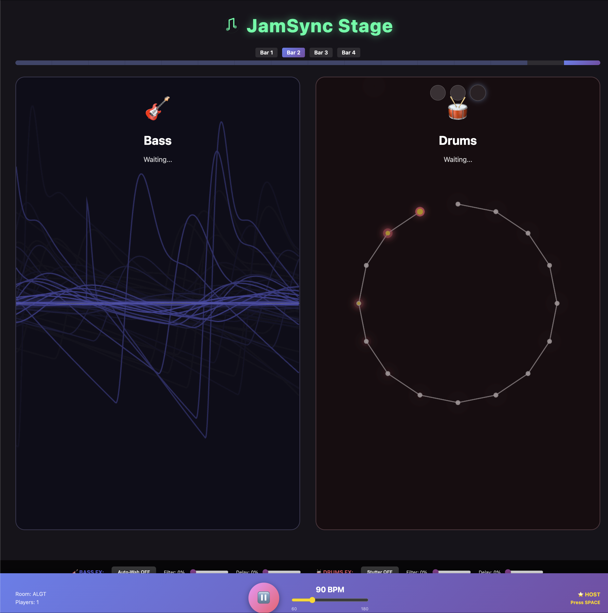

# JamSync

**Turn idle cycles into creative cycles.**
A multiplayer jam space for teams waiting on AI agents, builds, or long jobs.
Browser-based. Real-time sync via Supabase. Vaporwave aesthetic.

👉 **Live:** https://jamsync.fly.dev/


---

## What it is
JamSync lets a room of people create music together from their browsers while everything stays **in time** and **in key**. Each player controls an instrument with a simple XY pad (Bass = Density × Complexity; Drums = Density × Groove). A projector-friendly **Stage** view plays all audio and shows live visualizers, presence, tempo, and key.



### Why Supabase
- **Realtime channels** for transport (tempo, bar, play/stop, key) and presence.
- **Postgres + RLS** for durable state (room, instrument params) so reconnects recover cleanly.
- **Low-latency fan-out** that works great for a musical control surface.

### Key features
- **Vaporwave aesthetic** with neon colors, custom SVG icons, and animated gradients
- Shared clock with **bar-aligned corrections** for musical tightness
- **Presence & roles** (who's Bass, who's Drums, who's Stage)
- **Stage view** (2×2 instrument tiles with live visualizers, FX controls, play/pause)
- **Tablet-friendly, full-screen XY pads** for Bass and Drums
- **Web Audio API** synthesis (bass synth with auto-wah, drum machine with stutter)

### Screenshots

**Bass Control**


**Drums Control**


**Stage View (Audio Output)**


---

## 30-second try (no account)
1. Open the live app: https://jamsync.fly.dev/
2. Click **Create Room** - you'll get a shareable code
3. Open **Bass** and **Drums** views on different devices/tabs
4. Open the **Stage** view (projector-friendly - this is where audio plays)
5. Press **Play** on Stage
6. Move the **XY pads** on Bass/Drums - changes sync to Stage in real-time

   **Note:** Only Stage plays audio. Bass and Drums are silent controllers.

---

## Tech Stack
- **Frontend:** React, Vite, TypeScript, Tone.js (Web Audio)
- **Realtime & data:** Supabase Realtime (Broadcast + Presence), Postgres (RLS)
- **Hosting:** Fly.io (Docker + nginx)
- **Database:** PostgreSQL via Supabase

---

## Architecture

### Realtime Channels
Each room uses dedicated Supabase channels:
- **presence**: Who's online, their instrument role
- **transport**: Tempo, key, play/pause state, bar timing
- **bass**, **drums**: Instrument parameter broadcasts (XY position, FX)

### Local Audio Timing
The **Stage** plays all instruments locally using Tone.js, avoiding network jitter. Instruments only broadcast their parameters; the Stage schedules all notes against a shared musical clock.

### Database Schema
```sql
rooms              -- Room metadata
transport          -- Tempo, key, playback state per room
progression        -- Chord progression (future use)
instrument_params  -- Persistent instrument settings (future use)
```

Row Level Security (RLS) policies allow anonymous read/write for demo purposes.

---

## Local Development

### Prerequisites
- Node.js 18+
- Supabase account (free tier works)

### Setup
```bash
# Clone and install
npm install

# Create .env with your Supabase credentials
cp .env.example .env
# Edit .env with your VITE_SUPABASE_URL and VITE_SUPABASE_ANON_KEY

# Run database migrations (requires Supabase CLI)
supabase link --project-ref YOUR_PROJECT_REF
supabase db push

# Start dev server
npm run dev
```

Visit `http://localhost:5173`

---

## Deployment

### Fly.io
```bash
# Install flyctl
brew install flyctl

# Login to Fly
flyctl auth login

# Deploy (already configured in fly.toml)
flyctl deploy
```

The app is configured for auto-stop/start to minimize costs.

---

## The pitch
The modern "my code's compiling" is **"AGENT'S RUNNING."** JamSync turns that wait into a live, collaborative moment that keeps the room engaged and your demo alive. Perfect for team demos, hackathons, or just jamming while your build runs.

---

## Future Ideas
- **More instruments:** Harmony (pad chords), Melody (lead synth)
- **Chord progression editor:** Real-time chord changes
- **Recording & playback:** Save jam sessions
- **Better mobile support:** Touch-optimized controls
- **Authentication:** Named users, saved sessions
- **Datadog RUM:** Engagement analytics

---

## License
MIT
